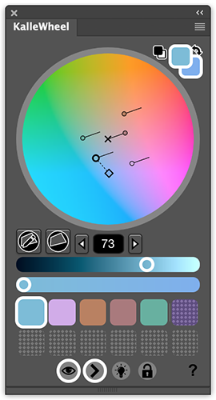

# KalleWheel
A custom color wheel extension for Adobe Photoshop.

KalleWheel is an extension made to make it easier for digital painters to choose colors in
Photoshop.

## Installation

### From Adobe addons page
Download and install the extension on the Adobe Add-ons page: https://creative.adobe.com/addons/products/12907#.WI59cLFiRE4

### Manual installation

This installation method is for testers and developers mainly. Information taken from ZXP installer page: https://aescripts.com/knowledgebase/index/view/faq/zxp-installer-faq/

#### Download extension

Download the zxp file from the addon page, or from the release page on github, then follow the OS specific steps. To install a specific version from github, e.g. for beta testing, clone the repository and copy the KalleWheel folder. This folder should be placed in the extensions folder specified below for the given OS.

#### Manual installation on Mac OS

* Rename the .zxp file to .zip.
* Unzip the zip file. Some people report that they must use Stuffit Expander to unzip it as the OS X utility does not work for them.
    If the extension was downloaded from github, the corresponding folder is the KalleWheel folder.
* In Finder Menu choose go->go to folder and enter the following folder name: `~/Library/Application Support/Adobe/CEP/extensions`
* Move the folder from the previous step into this folder.
* Open a terminal window and execute the following command: `defaults write com.adobe.CSXS.4 PlayerDebugMode 1`
    (This will tell Adobe programs to also run extensions that are installed in this manual way).
    Note, the 4 in com.adobe.CSXS.4 corresponds to the CSXS version of the program. For different versions of the software, a different number is needed. For reference to the latest version to update, all com.adobe.CSXS plist files can be found under `~/Library/Preferences/`
* After the plist file has been updated, read the file by, in the teminal, running `defaults read com.adobe.CSXS.9`
* Then restart Photoshop. The extension should be found under Windwow -> Extensions

#### Manual installation on Windows

* Rename the .zxp file to .zip
* Unzip the zip file
* Drag that unzipped folder into the folder `C:\Program Files (x86)\Common Files\Adobe\CEP\extensions\`
* Create a registry entry "PlayerDebugMode" with String value 1 in `HKEY_CURRENT_USER/Software/Adobe/CSXS.5`
    (To create and modify registry entries you can search for the program "regedit" in the windows menu)
* Then restart Photoshop. The extension should be found under Windwow -> Extensions

## Features

### HCL color space

A color choosen in KalleWheel is defined by the three components Hue (set by the angle from the center of the wheel), Chroma (similar to saturation, determined by the distance from the center of the wheel), and Lightness (set by the slider).

The HCL color space is directly derived from the CIELab color space which is made to reduce the interference our human perception have with the colors percieved. Comparing to the most common color space used by digital artists (HSB: Hue, Saturation, Brightness) a certain lightness will be percieved equally light independent on the other two light components. An example of this is when comparing a yellow color to a blue color. Even though the brightness (in HSB color space) is equal, the yellow color will seem brighter due to the pixel intensities of a screen as well as the way we percieve the colors. In the CIELab color space however, a yellow color with a certain lightness will seem roughly as light as a blue color with the same lightness.

Photoshop actually uses the CIELab colorspace when converting to grayscale, which also has to do with why the grayscale image to the right seems to have more diverse lightness between colors. But looking only at the color versions of the images above it is quite clear that the HCL color space better preserves the lightness of the colors. 

### Many colors in the same picker wheel

Photoshops default color picker does not allow the user to have many colors on the same picker and only change one of them at the time. The default picker only changes the active color which can be the background color or the foreground color of Photoshop.

There is a standard extension that comes with Photoshop called Adobe Color-themes (formerly Kuler) which KalleWheel is roughly based on. Adobe color themes lets you define up to five dependent or independent colors. Adobe Color-themes, however, is not made for picking colors for painting but rather to create color themes for graphical applications or similar. I stripped away the things that I did not need from Adome Color-themes and added the things that were more important, for example more color swatches. Currently you can define twelve colors on the wheel at the same time. So far I have never needed this many colors but it is nice to have in case.

### Light source direction indicators

The greatest advantage of having the Hue and Chroma light components on a 2D surface where Hue is directly dependent on the angle and Chroma goes from low in the center of the circle to high for bigger distances; is the possibility to take advantage of the fact that Hue and Chroma are not independent when it comes to the colors of illuminated real world objects. Using the standard Photoshop color picker with Saturation and Brightness orthogonal on a plane and Hue on a slider it is so much harder to transition for example from a pink to a green color by shifting two independent sliders (green and pink are opposite each other on the color wheel). Using the type of color wheel as KalleWheel or Adobe Color-themes are using, this is a much easier task. Just drag the color glyph from the pink towards the green on the circle; no need to handle two independent controllers.

This was actually the reason I started to paint using the Adobe Color-themes extension and eventually decided to build my own extension.

What is possible in KalleWheel that I have not seen in any other color picker is to define light source colors and then see how different colors are affected (shifted) by these light sources. This is done by displaying lines which are directed in the direction of the light source ([Some theory on this topic can be found here](http://kbladin.se/tools/color_changes.php), this is written before i made KalleWheel). The tool is just made to be used as a guideline but actually helps when picking colors for illuminated objects when painting digitally.

### Other features

* HCL / CIELab color space (mentioned above).
* More color swatches (mentioned above).
* Hide or display direction indicators for colors changed due to colored light sources (mentioned above).
* Only features that are necessary for painting and no extra things that take up space.
* Easier to control Lightness. By having one single slider for Lightness and the possibility to see the Lightness-value and change it by clicks the user hopefully gets more control over it. This is important since Lightness is generally the most important of the three color components when it comes to painting to create the illusion of a 3D scene.
* Bigger space for the actual color wheel for higher precision
* Possibility to lock and / or hide colors. Locking colors is useful if they are light source colors which are usually constant in a scene.
* Less lag (compared to Adobe Color-themes) when moving colors around the color wheel surface.
* Changing the Lightness of a color will redraw the entire color wheel with the same lightness. This makes it easier to see what color to change to when shifting the Hue / Chroma.
* Possibile to resize the extension window.
* Swatches are saved and reimported for reuse
* Four vertex gamut mask that can be edited and reimported when restarting the application.

### Current limitations

* Photoshop's internal colors are saved in the RGB format. This sometimes leads to problems due to some color ambiguity that is appearent between RGB and CIELab. RGB is a subset of CIELab so all colors selected in KalleWheel will not be defined in RGB, therefore the "closest" CIELab color will be choosen when sampling an RGB color. This happens with very high Chroma colors.

* I have only been able to test this extension on one computer with one OS in Photoshop CC. I would like to see how it works on other operating systems and other versions of Photoshop but so far it has not been possible to do this.

For suggestions or questions, [send me an email](mailto:kallebladin@gmail.com) or [post an issue](https://github.com/kbladin/KalleWheel/issues)

## External Libraries

External libraries used in this project are:

* [the javascript library Chroma](https://github.com/gka/chroma.js/)
* [XTools scripting library for Photoshop](http://ps-scripts.sourceforge.net/xtools.html)
* [Json-js JSON Library](https://github.com/douglascrockford/JSON-js)
* [Tippy.js Javascript tooltip library](https://atomiks.github.io/tippyjs/)
* Icons made by Freepik from [www.flaticon.com](www.flaticon.com/)
